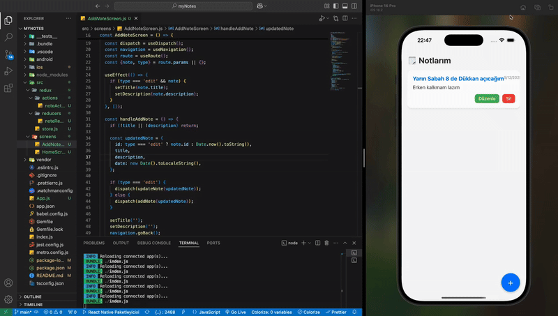

# 📝 React Native Not Uygulaması

Bu proje, React Native CLI kullanılarak geliştirilmiş bir mobil "Not Ekleme" uygulamasıdır. Uygulamada Redux kullanılarak global state yönetimi sağlanmıştır. Kullanıcılar not ekleyebilir, düzenleyebilir ve silebilir.

---

## 🚀 Özellikler

- 📝 Not ekleme
- 🧹 Not silme
- ✏️ Not güncelleme
- 💾 Redux ile state yönetimi
- 🎨 Modern ve profesyonel kullanıcı arayüzü
- ⚛️ React Native CLI yapısı (Expo değil)

---

## 🎥 Uygulama Görünümü

